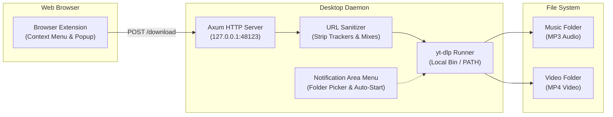

# YTD: YouTube and YouTube Music Downloader

YTD downloads YouTube videos and YouTube Music tracks directly from your web browser. The system contains two components: a Rust desktop daemon and a browser extension.

---

## System Architecture

The browser extension captures links and sends them to the local daemon. The desktop daemon runs an HTTP server on `127.0.0.1:48123`. The daemon sanitizes links and executes `yt-dlp` in the background. The daemon routes audio files to your Music folder and video files to your Video folder.



---

## Core Features

### URL Sanitization
- The daemon strips tracking parameters from all submitted links.
- The daemon removes mix parameters to download only the requested track.
- The daemon normalizes short links to canonical URLs.
- The daemon preserves user-created playlists.

### Automatic Media Routing
- The daemon converts YouTube Music links to high-quality MP3 audio files.
- The daemon saves audio files in the operating system Music folder.
- The daemon downloads standard YouTube links as MP4 video files.
- The daemon saves video files in the configured video folder.

### Zero-CLI Dependency Setup
- The daemon detects missing `yt-dlp` and `ffmpeg` binaries automatically.
- Users can install required binaries through a one-click dialog.
- The daemon downloads binaries directly into `%APPDATA%\ytd\bin\`.
- The daemon configures its internal process search path automatically.
- Users do not need to configure system environment variables.

### Desktop Integration
- The daemon displays an icon in the Windows notification area.
- Users can change the video download directory from the context menu.
- Users can toggle Windows startup from the context menu.
- The daemon displays Windows notifications during downloads.
- Release builds run in the background without open console windows.

---

## Prerequisites

- Windows 10 or Windows 11 (64-bit)
- Google Chrome, Microsoft Edge, or any Chromium browser
- For building from source: Rust 1.80 or later

---

## Quick Start

### 1. Run the Desktop Daemon

1. Download the latest release from the Releases page.
2. Run `ytd-daemon.exe`.
3. The daemon initializes an icon in the Windows notification area.
4. If prompted, click **Yes** to install `yt-dlp` and `ffmpeg` automatically.

### 2. Install the Browser Extension

1. Right-click the YTD icon in the Windows notification area.
2. Select **Install Browser Extension...**.
3. The daemon opens your browser extension settings and the extension directory.
4. Enable **Developer mode** in your browser.
5. Click **Load unpacked**.
6. Select the `extension` folder.

---

## Usage

1. Open YouTube or YouTube Music in your browser.
2. Right-click a link, a video player, or the page background.
3. Select **Send to YTD**.
4. The browser extension forwards the link to the local daemon.
5. The daemon downloads the media and displays a desktop notification.

---

## Configuration

The daemon stores settings in `%APPDATA%\ytd\config.json`.

```json
{
  "video_download_dir": "C:\\Users\\<user>\\Downloads\\ytd",
  "audio_download_dir": "C:\\Users\\<user>\\Music",
  "port": 48123,
  "auto_strip_mixes": true,
  "auto_start": false
}
```

To change the video directory, click **Change Video Download Folder...** in the notification area menu.

---

## Build From Source

1. Clone the repository.
2. Open a terminal in the project root directory.
3. Run the release build command:
   ```powershell
   cargo build --release
   ```
4. Find the compiled executable at `target\release\ytd-daemon.exe`.

---

## Automated Tests

Run the test suite with Cargo:

```powershell
cargo test
```

---

## Isolated Testing in Windows Sandbox

Test the zero-CLI installation in a clean environment:

1. Double-click `ytd_sandbox.wsb`.
2. Windows Sandbox starts an isolated virtual machine.
3. The sandbox script disables Smart App Control automatically.
4. Follow the on-screen prompts to verify dependency installation.
